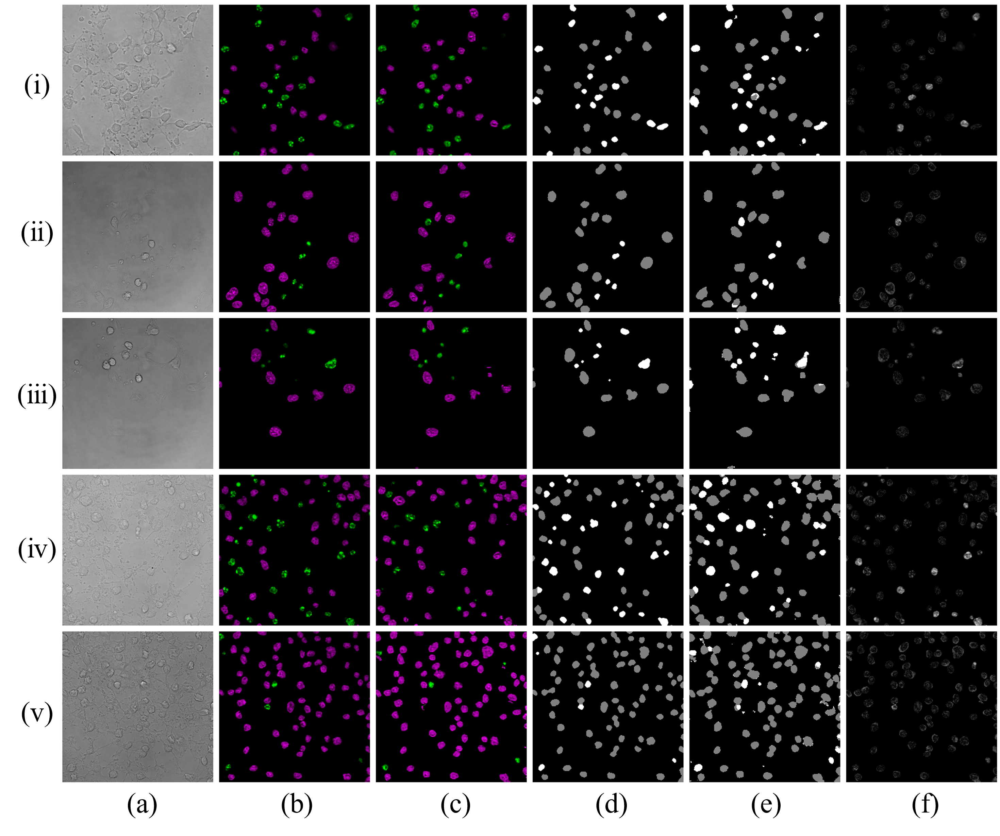
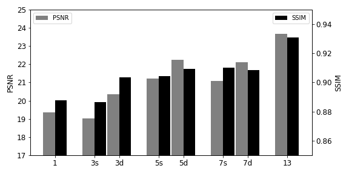

# fluorescent_image_translation
Attention conditional GAN model for bright-field image to fluorescent image translation
---

## Requiresments:
* Python 3
* PyTorch
* Torchvision
* Numpy
* OpenCV (cv2)
* Albumentations

## Train
* Code for train the CACGAN model:
```bash
python cacgan_train.py -n epoches --GAP generator_structure --DAL discriminator_structure --out_slice num_output_channels \
-s num_input_channels --down_step num_layers \
--has_mask -lg generator_lr -ld discriminator_lr \
##--RESUME -c path/to/dir # for continue training
```

* Code for performance testing:
```bash
python performance_evaluation.py -sn model_sn --test_path path/to/bright_field_images --Destination path/to/saving_folder -bs batch_size
```

## Data
Dataset processing is presented in [DBcell processing Unit.ipynb](https://github.com/SpikeRXWong/fluorescent_image_translation/blob/main/DBcell%20processing%20Unit.ipynb). One example of training dataset is saved in folder [8_hr_cs2_z_144](https://github.com/SpikeRXWong/fluorescent_image_translation/tree/main/dataset_example). It contains: bright_field image stach (13 slices), processed fluorescent images (one slice version for and two slice version), nuclei segmentation (mask for two categories).


## Result

* Translation result of CACGAN

Translation result of Cross-Attention cGAN (CACGAN) model with attention module location "0011". Column (a): middle slice of input bright-field image stack; column (b): ground truth fluorescent images, with nuclei false-coloured such that magenta represents healthy nuclei and green represents apoptotic nuclei; **column (c)**: translation result from the model with equivalent false-colouring applied; column (d): the ground truth classification of nuclei, gray represents healthy nuclei and white represents apoptotic nuclei; column (e): the semantic segmentation result by the model; column (f): the MAE error map between the target and generative fluorescent images.

* Performance of diffent number of input slice of bright-field images

"s" means slice separation remains unchanged, and "d" represent total depth unchanged


## Network Architecure

### CACGAN Network
* [cacgan](https://github.com/SpikeRXWong/fluorescent_image_translation/blob/main/cacgan_network.py)
