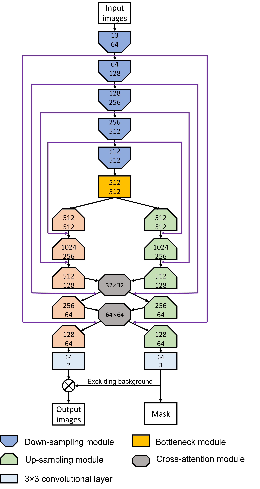
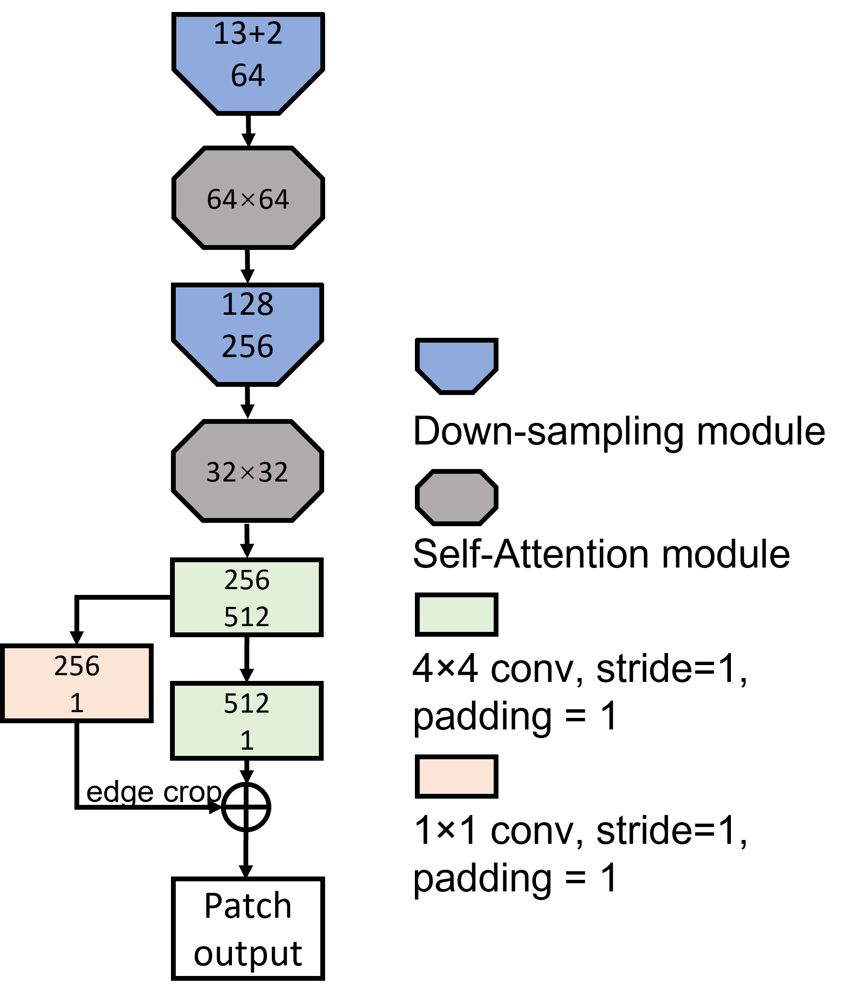

# Fluorescent image translation

This is a PyTorch implementation of the Cross-attention conditional GAN (XAcGAN) model for **Bright-Field to Fluorescence Microscopy Image Translation for Cell Nuclei Health Quantification**.
URL: https://doi.org/10.1017/S2633903X23000120


## Requirements:
* Python == 3.7.10
* PyTorch == 1.8.1
* Torchvision == 0.9.1
* Numpy == 1.20.2
* OpenCV (cv2) == 4.2.0
* Albumentations == 1.0.1

## Data
All the images used in this work can be accessed at the [link](https://doi.org/10.5523/bris.2w8trsx55b0k22qez7uycg9sf4). Pre-processing process for the training dataset is presented in [Raw image dataset pre-proceesing](https://github.com/SpikeRXWong/fluorescent_image_translation/blob/main/utils/preprocessing.md). One example of the training dataset is saved in folder [8_hr_cs2_z_144](https://github.com/SpikeRXWong/fluorescent_image_translation/tree/main/Image/8_hr_cs2_z_144). Individual training folder contains bright-field image stach (13 slices), processed fluorescent images (one slice version for and two slice version), nuclei segmentation (mask for two categories). Code for dataset setup in [dbcelldataset.py ](https://github.com/SpikeRXWong/fluorescent_image_translation/blob/main/dbcelldataset.py). [Two ways](https://github.com/SpikeRXWong/fluorescent_image_translation/blob/main/dbcelldataset.py#L151) for slice selection for bright-field image stacks when the input slices are less than 13.

## Network
Network architecture for generator and discriminator are implemented in [xacgan_network.py](https://github.com/SpikeRXWong/fluorescent_image_translation/blob/main/xacgan_network.py). Structure of attention module is implemented in [cross_attention_network.py](https://github.com/SpikeRXWong/fluorescent_image_translation/blob/8cf0e9997fd6ab3ce1b77159fd1f84b5d9232c95/cross_attention_network.py).
1. Generator (XAcGAN 0011):  
 
2. Discriminator:  


## Train
- Code for training the XAcGAN 0011 model:

```bash
python xacgan_train.py --GAP 00110 --DAL two --out_slice 2 -s 13 --down_step 5 --has_mask \
  ##--RESUME -c path/to/dir # for continue training
```

- Code for training the SAcGAN 0011 model with single output channel:
```bash
python xacgan_train.py --GAP 00110 --DAL two --out_slice 1 -s 13 --down_step 5
```

- Code for training the SAcGAN 0011 model with two output channels:
```bash
python xacgan_train.py --GAP 00110 --DAL two --out_slice 2 -s 13 --down_step 5
```

- Code for training pix2pix model for comparison
```bash
python pix2pix_compare.py -s 13 --out_slice 1
```

- Code for performance testing: 
```bash
python performance_evaluation.py -model_path path/to/pretrained/model -bs batch_size \
  --test_path path/to/bright_field_images \
  --Destination path/to/saving_folder -bs batch_size
```
> Pretrained XAcGAN 0011 model can be downloaded via the [link](https://drive.google.com/file/d/1fdncjtp8rmAD3Sp7WrCplmm6Dw6dt1vM/view?usp=sharing) on GoogleDrive.

## Result

### 1. Translation result of XAcGAN:  

1. Performance of XAcGAN model:  
  
2. Result of XAcGAN 0011 model:  
  

Translation result of Cross-Attention cGAN (XAcGAN) model with attention module location "0011". **Column (a)**: middle slice of input bright-field image stack;   **column (b)**: ground truth fluorescent images, with nuclei false-coloured such that magenta represents healthy nuclei and green represents apoptotic nuclei; **column (c)**: translation result from the model with equivalent false-colouring applied; **column (d)**: the ground truth classification of nuclei, gray represents healthy nuclei and white represents apoptotic nuclei; **column (e)**: the semantic segmentation result by the model; **column (f)**: the MAE error map between the target and generative fluorescent images.  

### 2. Performance of different number of input slice of bright-field images:    
  

"s" means slice separation remains unchanged, and "d" represents total depth unchanged

### 3. Comparison to SAcGAN model:   
  
