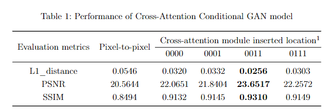
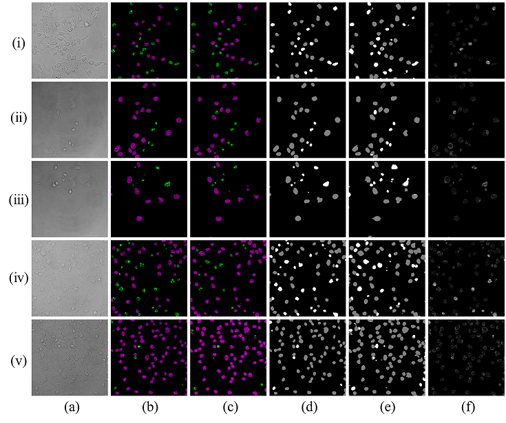
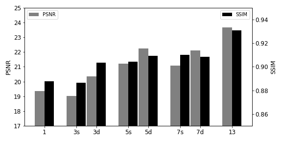
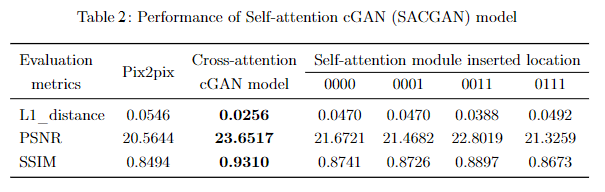

# Fluorescent image translation
---
This is a PyTorch implementation of __Cross-attetnion conditional GAN (CACGAN) model for bright-field image to fluorescent image translation.
---

## Requiresments:
* Python == 3.7.10
* PyTorch == 1.8.1
* Torchvision == 0.9.1
* Numpy == 1.20.2
* OpenCV (cv2) == 4.2.0
* Albumentations == 1.0.1

## Data
Dataset processing is presented in [DBcell processing Unit.ipynb](https://github.com/SpikeRXWong/fluorescent_image_translation/blob/main/utils/DBcell%20processing%20Unit.ipynb). One example of training dataset is saved in folder [8_hr_cs2_z_144](https://github.com/SpikeRXWong/fluorescent_image_translation/tree/main/Image/8_hr_cs2_z_144). It contains: bright_field image stach (13 slices), processed fluorescent images (one slice version for and two slice version), nuclei segmentation (mask for two categories). Code for dataset setup in [dbcelldataset.py ](https://github.com/SpikeRXWong/fluorescent_image_translation/blob/main/dbcelldataset.py). [Two ways](https://github.com/SpikeRXWong/fluorescent_image_translation/blob/main/dbcelldataset.py#L151) for slice selection for bright-field image stacks when the input slices are less than 13.

## Train
- Code for training the CACGAN 0011 model:

```bash
python cacgan_train.py --GAP 00110 --DAL two --out_slice 2 -s 13 --down_step 5 --has_mask \
##--RESUME -c path/to/dir # for continue training
```

- Code for training the SACGAN 0011 model with single output channel:
```bash
python cacgan_train.py --GAP 00110 --DAL two --out_slice 1 -s 13 --down_step 5
```

- Code for training the SACGAN 0011 model with two output channels:
```bash
python cacgan_train.py --GAP 00110 --DAL two --out_slice 2 -s 13 --down_step 5
```

- Code for training pix2pix model for comparison
```bash
python pix2pix_compare.py -s 13 --out_slice 1
```

- Code for performance testing:
```bash
python performance_evaluation.py -sn model_sn -bs batch_size \
  --test_path path/to/bright_field_images \
  --Destination path/to/saving_folder -bs batch_size
```

## Result

### 1. Translation result of CACGAN:  

1. Performance of CACGAN model:  
  
2. Result of CACGAN 0011 model:  
  

Translation result of Cross-Attention cGAN (CACGAN) model with attention module location "0011". **Column (a)**: middle slice of input bright-field image stack;   **column (b)**: ground truth fluorescent images, with nuclei false-coloured such that magenta represents healthy nuclei and green represents apoptotic nuclei; **column (c)**: translation result from the model with equivalent false-colouring applied; **column (d)**: the ground truth classification of nuclei, gray represents healthy nuclei and white represents apoptotic nuclei; **column (e)**: the semantic segmentation result by the model; **column (f)**: the MAE error map between the target and generative fluorescent images.  

### 2. Performance of diffent number of input slice of bright-field images:    
  

"s" means slice separation remains unchanged, and "d" represent total depth unchanged

### 3. Comparision to SACGAN model:   
  
