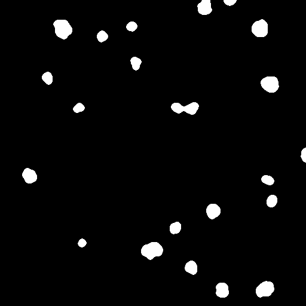

# Raw Image Dataset Pre-Processing

The raw images are LIF version. In the image pre-processing, Readlif, OpenCV and scikit-image package are imported. 
```python
import numpy as np
import cv2
from readlif.reader import LifFile
from skimage.segmentation import watershed
from skimage.feature import peak_local_max
```

Raw fluorescent image stack has 13 slices, we use the whole image stack for mask generation and the centrol slice as translation target.

> Example image of maximum along z-stack of raw fluorescent image.  
> 

Contrast Limited Adaptive Histogram Equalization (CLAHE) is applied on maximum image of fluorescent image stacks. Then Gaussin Blur and median filter are appled for denoising and connecting split spots together.          
```python
clahe = cv2.createCLAHE(clipLimit=2, tileGridSize = (32,32))

frmd = clahe.apply(frm)
for i in range(16):
    if i < 4:
        frmd = cv2.GaussianBlur(frmd, (3,3), 0)
    else:
        frmd = cv2.medianBlur(frmd, 5)
```

Ostu threshold is applied for foreground segmentation. And we used mask watershed for individual nuclei partition.

```python
ret, th = cv2.threshold(frmd, 0, 255, cv2.THRESH_BINARY+cv2.THRESH_OTSU)

dist_transform = cv2.distanceTransform(th,cv2.DIST_L2,5)

coords = peak_local_max(dist_transform, min_distance = 8, exclude_border=False, footprint=np.ones((8, 8)))
coords = remove_close_coords(coords,12)

markers = np.zeros_like(dist_transform).astype(np.int32)
for i in range(len(coords)):
    markers[tuple(coords[i].T)] = i+1
    
labels = watershed(-dist_transform, markers, mask=th)
```

> Nuclei mask instance segmentation  
> 

We calculate the standard deviation within each individual. And used Otsu threshod method to separate them into two groups. Areas with high standard deviation indicate apoptotic nuclei and the others are healthy nuclei.

```python
mask_list = []
for i in range(len(coords)):
    m = (labels == (i+1))
    mask_list.append(m)
mask = np.array(mask_list)

sd = []
for i in range(len(coords)):    
    im = (clahe.apply(frm)).astype(np.float32)[mask[i]]
    stdiv = im.std()
    sd.append(stdiv)
nsd = np.array(sd)

sidx = np.argsort(nsd)
snsd = nsd[sidx]
new = 0
for i in range(1, len(snsd)-1):
    pre = snsd[:i]
    post = snsd[i:]
    result = i * (len(snsd)-i) * (pre.mean() - post.mean())**2 / (len(snsd)**2)
    if result < new:
        index_sd = i-1
        break
    else:
        new = result

threshold_sd = snsd[index_sd]
label1_sd = np.where(nsd >= threshold_sd)[0] + 1
label2_sd = np.where(nsd < threshold_sd)[0] + 1
```
> The auto classification result is shown below, and nuclei are labelled with in two colours indicate different healthy state.  
> 

To correct the labelling error, we manually move the wrong items to other group. For example, we move item 13 to the other group. 
> Final classifcation result:   
> 

Finally, save the segmentation results and used for traininig.
> Middel slice of Bright-field image stack and target fluorescent image:
> |Bright-field|Fluorescent|  
> |:----:|:----:|
> |||

> Fluorescent image segmenation result and tranlation target:
> ||Apoptotic|Healthy|  
> |:----:|:----:|:----:|
> |**Fluorescent**|||
> |**Mask**|||
